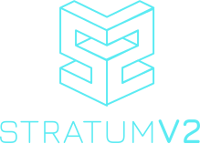

 
   
  <b>$ plebhash #</b>
   
  
    
  bitcoin+mining+nix+rust
    
  <b>PGP:</b> 37DA 6F2F 5996 6316
   
  <b>npub</b>1rqx9zlmy7k2mre2t6t880rxv9fttzyl95jc5ym2tpfpepqcppkcs3ss548
    

   
  <a href="source/whoami.html">whoami</a>
   
  <a href="https://github.com/plebhash" target="_blank">code</a>
   
  <a href="https://x.com/plebhash" target="_blank">tweets</a>
   
  <a href="https://iris.to/npub1rqx9zlmy7k2mre2t6t880rxv9fttzyl95jc5ym2tpfpepqcppkcs3ss548" target="_blank">notes and other stuff transmitted by relay</a>
    
  

  work
    
  <table class="tg"><thead>
    <tr>
      <th>
 <a href="https://stratumprotocol.org" target="_blank">Stratum Reference Implementation</a>
</th>
      <th class="tg-0lax">
 <a href="https://github.com/plebhash/nix-bitcoin-core-archive" target="_blank">nix-bitcoin-core-archive</a>
</th>
      <th class="tg-0lax">
 <a href="https://github.com/plebemineira/plebpool" target="_blank">plebpool</a>
</th>
    </tr></thead>
  <tbody>
    <tr>
      <td>
a protocol for pooled Bitcoin mining  grant:    <a href="https://spiral.xyz" target="_blank">spiral.xyz</a>
</td>
      <td>
an archive of Nix derivations for old bitcoin releases and custom forks
</td>
      <td>
a pleb-friendly Bitcoin mining pool leveraging:
          
        - Lightning via <a href="https://lightningdevkit.org/">LDK</a> 
        - StratumV2 via <a href="https://stratumprotocol.org">SRI</a> 
      
</td>
    </tr>
  </tbody>
</table>

 

<table class="tg"><thead>
    <tr>
      <th>

Full disclosure on <b>plebpool</b>
      
</th>
    </tr></thead>
  <tbody>
    <tr>
      <td>

      All code is provided as FOSS (under <a href="https://github.com/plebemineira/plebpool/blob/master/LICENSE-APACHE" target="_blank">Apache 2.0</a> + <a href="https://github.com/plebemineira/plebpool/blob/master/LICENSE-MIT" target="_blank">MIT</a>), and I have no intention to create a business or revenue stream from it.
        
      Given the low hashrate this pool will attract (if any), this implementation will never be meaningful economic competition on the Bitcoin mining landscape.
        
      While a harsh critic could potentially label this as a LARP and a waste of time, I personally feel this is an important exercise with the goals of:
       
      - walking the shoes of a community developer trying to consume SRI APIs
       
      - creating community engagement with the pleb mining community, where a lot of FOSS hasher hardware is flourishing (e.g.: <a href="https://bitaxe.org" target="_blank">BitAxe</a>)
      
</td>
    </tr>
  </tbody>
</table>

 
 plebs be hashin 
  

